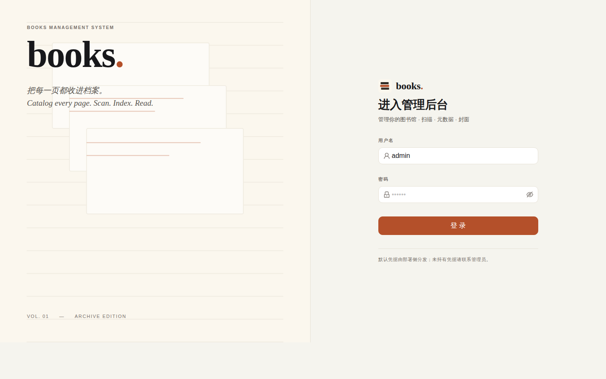

# Books Management System / 图书管理系统

一个自托管的电子书库：扫描本地书籍目录、抓取豆瓣 / Google Books 元数据与封面、提供在线阅读与个性化推荐，并附带管理后台与读者端两套前端，支持 Web / 桌面 / 移动多端壳。

详细设计见 [`architecture.md`](architecture.md)。

## 界面预览

| 管理后台（admin-web） | 读者端（reader-web） |
|---|---|
|  |  |

## 功能概览

- **后端（FastAPI + PostgreSQL + Redis + Celery）**：目录扫描与元数据提取、在线数据同步（豆瓣 / Google Books）、全文搜索、智能推荐、用户认证、WebSocket 通知
- **管理后台（Next.js / Ant Design）**：书库管理、扫描任务、元数据与封面编辑、用户管理
- **读者端（Next.js）**：书架、封面墙、详情页、在线阅读器（PDF / EPUB / MOBI / TXT / AZW3 / DJVU）、阅读进度
- **多端壳**：`apps/desktop-shell`（Tauri）、`apps/mobile-shell`
- **部署**：`docker-compose.prod.yml` 多容器，或 `Dockerfile.allinone` 单镜像（backend + admin + reader + nginx + supervisor）

## 快速开始

```bash
cp .env.example .env          # 配置 POSTGRES_PASSWORD / SECRET_KEY / ADMIN_PASSWORD 等
docker compose -f docker-compose.prod.yml up -d
# admin-web → :3000   reader-web → :3001   backend API → :8000
```

## 仓库结构

```
backend/            FastAPI 服务 + Celery worker/beat + Alembic 迁移
frontend/admin-web/ 管理后台（Next.js）
frontend/reader-web/读者端（Next.js）
apps/desktop-shell/ 桌面壳（Tauri）
apps/mobile-shell/  移动壳
infra/deploy/       systemd / nginx / 证书等部署资料
architecture.md     架构与技术选型设计文档
```
